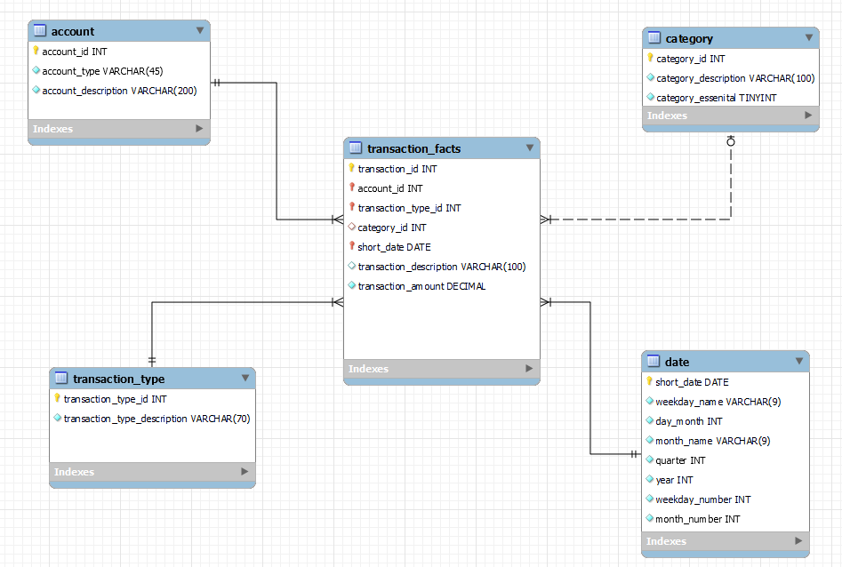

# Data Dictionary

## Schema

## Table Descriptions

#### "account" Dimension Table

| Field                | Data Type | Description                               |
|----------------------|-----------|-------------------------------------------|
| account_id           | int       | Unique identifier and primary key         |
| account_type         | str       | Type of account - checking, savings, or credit card |
| account_description  | str       | Details about the account                 |

#### "transaction_type" Dimension Table

| Field                | Data Type | Description                               |
|----------------------|-----------|-------------------------------------------|
| transaction_type_id  | int       | Unique identifier and primary key        |
| account_type         | str       | Details related to each type of transaction |

#### "category" Dimension Table

| Field                | Data Type | Description                               |
|----------------------|-----------|-------------------------------------------|
| category_id          | int       | Unique identifier and primary key.        |
| category_description | str       | Description of the category (e.g., "food & drink", "groceries") |
| category_essential   | bool      | Boolean value indicating if the purchases in this category are essential goods |

#### "date" Dimension Table

| Field                | Data Type | Description                               |
|----------------------|-----------|-------------------------------------------|
| short_date           | date      | Date in the form of "yyyy-mm-dd"; serves as the table's unique identifier and primary key. |
| weekday_name         | str       | The name day of the week (e.g., "Monday") |
| day_month            | int       | The day of the month ("1", "15", etc.) |
| month_name           | str       | The name of the month (e.g., "January") |
| quarter              | int       | Quarter of the year as an integer (e.g. "1") |
| year                 | int       | Year in the form of "yyyy"                 |
| weekday_number       | int       | An integer that corresponds to the index position of day ofthe week ("1" for Sunday, "2" for Monday, etc.) |
| month_number         | int       | Month of the year as an integer (e.g., "1" for January) |

#### "transaction_facts" Fact Table

| Field                  | Data Type | Description                               |
|------------------------|-----------|-------------------------------------------|
| transaction_id         | int       | Unique identifier and primary key         |
| account_id             | int       | Foreign key referencing "account_id" in the "account" dimension table (mandatory one-to-many relationship) |
| transaction_type_id    | int       | Foreign key referencing "transaction_type_id" in the "transaction_type" dimension table (mandatory one-to-many relationship) |
| category_id            | int       | Foreign key referencing "category_id" in the "category" dimension table (optional one-to-many relationship; only purchases marked with a category; null for non-purchase transactions) |
| short_date             | date      | Date of the transaction in "yyyy-mm-dd" format; foreign key referencing "short_date" in the "date" dimension table (mandatory one-to-many relationship) |
| transaction_description| str       | Description of the transaction (autogenerated at the time of the transaction) |
| transaction_amount     | str       | Amount of the transaction (negative for purchases and bank account balance reduction, positive for bank balance increase and credit card bill payments) |

_Note: The "transaction_facts" Fact Table includes a check constraint to enforce the relationship between transactions and categories. This constraint ensures that only purchase transactions have a category, while other non-purchase transactions have a null value for the category_id field._
